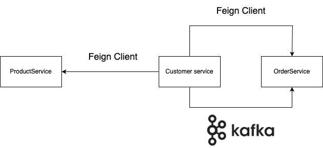
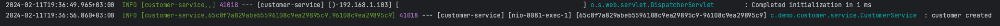
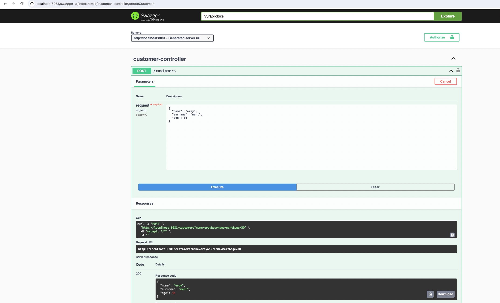
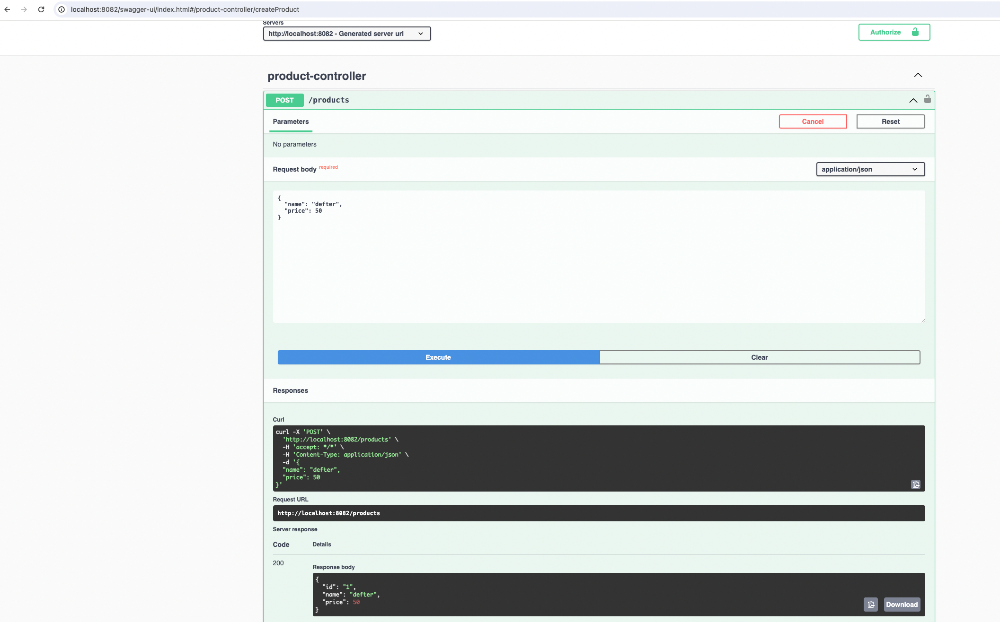
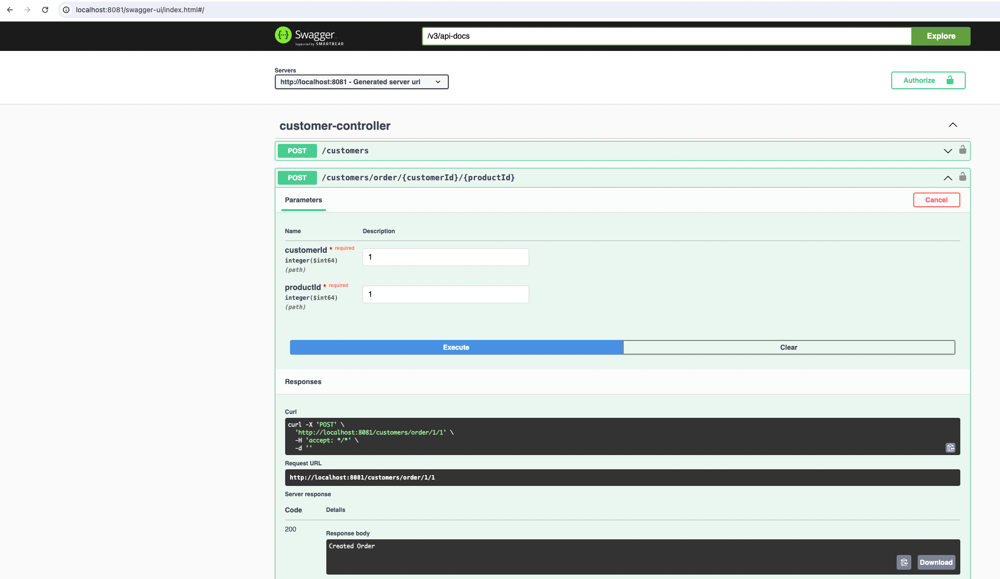
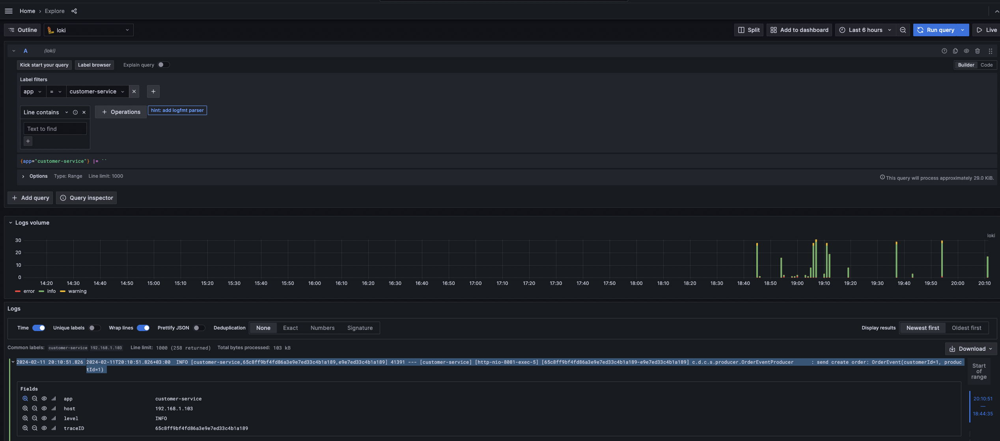
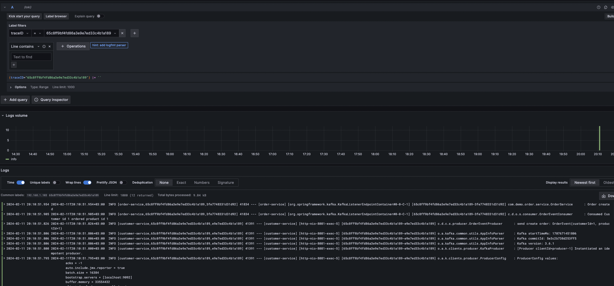

# Microservice micrometer log tracing

I attempted to explain the libraries and some monitoring tools used to trace logs in projects written with a microservices architecture.

## Technologies Used

* Java 17
* Springboot 3
* Feign Client
* Apache Kafka
* Swagger
* H2 Database
* Zipkin
* Grafana
* Mapstruct
* Micrometer

## Architecture Diagram



## Running on Your Computer

Clone the project

```bash
https://github.com/ErayMert/microservice-log-tracing.git
```

Navigate to the project directory in the terminal

```bash
  cd microservice-log-tracing
```

* The docker-compose.yml file contains configurations for Kafka, Grafana, Zipkin, Zookeeper, Tempo, and Loki.

```yml
version: '3.8'

services:
  grafana:
    image: grafana/grafana-enterprise:latest
    volumes:
      - ./docker/grafana/datasources.yml:/etc/grafana/provisioning/datasources.yaml
    environment:
      - GF_AUTH_ANONYMOUS_ENABLED=true
      - GF_AUTH_ANONYMOUS_ORG_ROLE=Admin
      - GF_AUTH_DISABLE_LOGIN_FORM=true
    ports:
      - "3000:3000"

  zipkin:
    image: openzipkin/zipkin:latest
    ports:
      - "9411:9411"

  zookeeper:
    image: docker.io/bitnami/zookeeper:3.8
    restart: always
    hostname: zookeeper
    container_name: zookeeper
    ports:
      - "2181:2181"
    environment:
      ZOOKEEPER_CLIENT_PORT: 2181
      ZOOKEEPER_TICK_TIME: 2000
      ALLOW_ANONYMOUS_LOGIN: yes

  kafka:
    image: wurstmeister/kafka
    container_name: kafka
    ports:
      - "9092:9092"
    environment:
      KAFKA_ADVERTISED_HOST_NAME: localhost
      KAFKA_ZOOKEEPER_CONNECT: zookeeper:2181

  loki:
    image: grafana/loki:main
    command: [ "-config.file=/etc/loki/local-config.yaml" ]
    ports:
      - "3100:3100"

  tempo:
    image: grafana/tempo:2.2.4
    command: [ "--target=all", "--storage.trace.backend=local", "--storage.trace.local.path=/var/tempo", "--auth.enabled=false" ]
    ports:
      - "14250:14250"
      - "4317:4317"
    depends_on:
      - loki
```

You can start these tools with the following command:

```docker
  docker-compose up -d
```

## Added Libraries

* Brave is a library that enables tracing in distributed systems. Especially useful in complex systems like microservices architectures, it tracks requests passing through gateways, allowing you to see how requests interact with each other and how they are responded to.

```xml
<dependency>
    <groupId>io.micrometer</groupId>
    <artifactId>micrometer-tracing-bridge-brave</artifactId>
</dependency>
```

* This dependency allows for the collection of metrics and monitoring via Micrometer in applications using OpenFeign.

```xml
<dependency>
    <groupId>io.github.openfeign</groupId>
    <artifactId>feign-micrometer</artifactId>
</dependency>
```

* Zipkin is a tracing system and server that provides tracing and debugging capabilities in distributed systems. The zipkin-reporter-brave dependency provides the necessary reporter functionality to send reports to Zipkin via the Brave library, enabling tracing in your application through Zipkin.

```xml
<dependency>
    <groupId>io.zipkin.reporter2</groupId>
    <artifactId>zipkin-reporter-brave</artifactId>
</dependency>
```
* Developed by Grafana Labs. The loki-logback-appender dependency allows for redirecting log messages from Logback to Loki. This enables storing your application's logs in Loki and visualizing them with Grafana.

```xml
<dependency>
    <groupId>com.github.loki4j</groupId>
    <artifactId>loki-logback-appender</artifactId>
    <version>1.3.2</version>
</dependency>
```

## Logback-spring.xml File

* I configured the file as below since I'm tracing logs in Loki datasource in Grafana. This file should be present in every project.
* The label sections correspond to the parts used for searching in Loki.

```xml
<?xml version="1.0" encoding="UTF-8"?>
<configuration>
    <include resource="org/springframework/boot/logging/logback/base.xml"/>
    <springProperty scope="context" name="appName" source="spring.application.name"/>

    <appender name="LOKI" class="com.github.loki4j.logback.Loki4jAppender">
        <http>
            <url>http://localhost:3100/loki/api/v1/push</url>
        </http>
        <format>
            <label>
                <pattern>app=${appName},host=${HOSTNAME},traceID=%X{traceId:-NONE},level=%level</pattern>
            </label>
            <message>
                <pattern>${FILE_LOG_PATTERN}</pattern>
            </message>
            <sortByTime>true</sortByTime>
        </format>
    </appender>

    <root level="INFO">
        <appender-ref ref="LOKI"/>
    </root>

</configuration>
```

## Configuration in application.yml

* The following setting indicates that all tracing data will be collected. That is, each request is traced and stored with a 100% probability.
``` yml
management:
  tracing:
    sampling:
      probability: 1.0
```
* This setting provides Zipkin configuration and allows Spring Boot 3 to connect to a remote server.
* By default `http://localhost:9411/api/v2/spans`, we don't need to specify the endpoint, but we need to for a standalone server.

``` yml
management:
  zipkin:
    tracing:
      endpoint: "http://localhost:9411/api/v2/spans"
```
* The following config specifies how the traceId and spanId will be reflected in the output.

``` yml
logging:
  pattern:
    level: "%5p [${spring.application.name:},%X{traceId:-},%X{spanId:-}]"
```

* The output in the console looks like this: 



## Micrometer Configuration for Kafka

* For the Producer: 
    * Set `kafkaTemplate.setMicrometerEnabled(true);`
    * Set `kafkaTemplate.setObservationEnabled(true);`
  
```java
@RequiredArgsConstructor
@Configuration
public class ProducerConfiguration {

    private final KafkaProperties kafkaProperties;

    @Bean
    public ProducerFactory<String, Object> producerFactory() {
        Map<String, Object> configProps = new HashMap<>();
        configProps.put(ProducerConfig.BOOTSTRAP_SERVERS_CONFIG, kafkaProperties.getAddress());
        configProps.put(ProducerConfig.KEY_SERIALIZER_CLASS_CONFIG, StringSerializer.class);
        configProps.put(ProducerConfig.VALUE_SERIALIZER_CLASS_CONFIG, JsonSerializer.class);
        
        return new DefaultKafkaProducerFactory<>(configProps);
    }

    @Bean
    public KafkaTemplate<String, Object> kafkaTemplate() {

        KafkaTemplate<String, Object> kafkaTemplate = new KafkaTemplate<>(producerFactory());
        kafkaTemplate.setMicrometerEnabled(true);
        kafkaTemplate.setObservationEnabled(true);

        return kafkaTemplate;
    }
}
```

* For the Consumer:
    * Set `factory.getContainerProperties().setObservationEnabled(true);`
    * Set `factory.getContainerProperties().setMicrometerEnabled(true);`
    * Set `factory.getContainerProperties().setLogContainerConfig(true);`
    * Set `factory.getContainerProperties().setCommitLogLevel(LogIfLevelEnabled.Level.INFO);`

```java
@Slf4j
@RequiredArgsConstructor
@Configuration
public class KafkaConsumerConfiguration {

    private final KafkaProperties kafkaProperties;

    @Bean
    public KafkaListenerContainerFactory<ConcurrentMessageListenerContainer<String, Object>> kafkaListenerContainerFactory() {
        ConcurrentKafkaListenerContainerFactory<String, Object> factory =
                new ConcurrentKafkaListenerContainerFactory<>();

        factory.getContainerProperties().setObservationEnabled(true);
        factory.getContainerProperties().setMicrometerEnabled(true);
        factory.getContainerProperties().setLogContainerConfig(true);
        factory.getContainerProperties().setCommitLogLevel(LogIfLevelEnabled.Level.INFO);
        factory.setConsumerFactory(new DefaultKafkaConsumerFactory<>(consumerConfigs()));
        return factory;
    }

    @Bean
    public Map<String, Object> consumerConfigs() {
        Map<String, Object> props = new HashMap<>();
        props.put(ConsumerConfig.BOOTSTRAP_SERVERS_CONFIG, kafkaProperties.getAddress());
        props.put(ConsumerConfig.KEY_DESERIALIZER_CLASS_CONFIG, StringDeserializer.class);
        props.put(ConsumerConfig.VALUE_DESERIALIZER_CLASS_CONFIG, JsonDeserializer.class);
        props.put(ConsumerConfig.GROUP_ID_CONFIG, kafkaProperties.getGroupId());
        props.put(ConsumerConfig.AUTO_OFFSET_RESET_CONFIG, "latest");
        props.put(JsonDeserializer.TRUSTED_PACKAGES, "*");
        return props;
    }

}
```

## Micrometer Configuration for Async

* By design you can only have one AsyncConfigurer, thus only one executor pool is

```java
import io.micrometer.context.ContextExecutorService;
import io.micrometer.context.ContextSnapshot;
import java.util.concurrent.Executor;
import lombok.RequiredArgsConstructor;
import org.springframework.beans.factory.annotation.Qualifier;
import org.springframework.context.annotation.Configuration;
import org.springframework.scheduling.annotation.AsyncConfigurer;
import org.springframework.scheduling.concurrent.ThreadPoolTaskExecutor;

@Configuration(proxyBeanMethods = false)
@RequiredArgsConstructor
public class AsyncTraceContextConfig implements AsyncConfigurer {

  // NOTE: By design you can only have one AsyncConfigurer, thus only one executor pool is
  // configurable.
  @Qualifier("taskExecutor") // if you have more than one task executor pools
  private final ThreadPoolTaskExecutor taskExecutor;

  @Override
  public Executor getAsyncExecutor() {
    return ContextExecutorService.wrap(
            taskExecutor.getThreadPoolExecutor(),
                    ContextSnapshotFactory.builder().build()::captureAll);
  }
}
```
* If you have more than one executor pools and wants to add tracing to all, use the TaskDecorator with ContextSnapshot.wrap():

```java
import io.micrometer.context.ContextSnapshot;
import java.util.concurrent.Executor;
import org.springframework.boot.task.TaskExecutorBuilder;
import org.springframework.context.annotation.Bean;
import org.springframework.context.annotation.Configuration;
import org.springframework.core.task.TaskDecorator;

@Configuration
public class AsyncConfig {
  @Bean
  public TaskDecorator otelTaskDecorator() {
    return runnable -> ContextSnapshotFactory.builder().build()
                                      .captureAll((new Object[0])).wrap(runnable);
  }

  @Bean("asyncExecutorPool1")
  public Executor asyncExecutorPool1(TaskDecorator otelTaskDecorator) {
    return new TaskExecutorBuilder()
        .corePoolSize(5)
        .maxPoolSize(10)
        .queueCapacity(10)
        .threadNamePrefix("threadPoolExecutor1-")
        .taskDecorator(otelTaskDecorator)
        .build();
  }

  @Bean("asyncExecutorPool2")
  public Executor asyncExecutorPool2(TaskDecorator otelTaskDecorator) {
    return new TaskExecutorBuilder()
        .corePoolSize(5)
        .maxPoolSize(10)
        .queueCapacity(10)
        .threadNamePrefix("threadPoolExecutor2-")
        .taskDecorator(otelTaskDecorator)
        .build();
  }
}
```
## Trying it out on the Application

* First, let's create a customer and a product using Swagger.




* Then, the customer will create an order, and the customer service will communicate with the order service via Kafka to create an order.


### Log Tracing with Grafana

* Connect to Grafana using the address <http://localhost:3000>
* The configuration of logback-spring.xml on Loki datasource in Grafana looks like this:


* Let's observe the order creation we tried above on Grafana.
  * First, we'll obtain a traceId from the customer service, and then we'll search on Loki using this traceId to observe all logs associated with this traceId.


  * Let's search with the traceId we obtained, and we'll see all service logs associated with this traceId.



### Log Tracing with Zipkin
* To connect to Zipkin, use the address <http://localhost:9411>

* If we observe the order creation request on Zipkin, we'll see output like this:


### Happy coding, and may your microservices journey be filled with successful deployments and seamless operations!"


  
